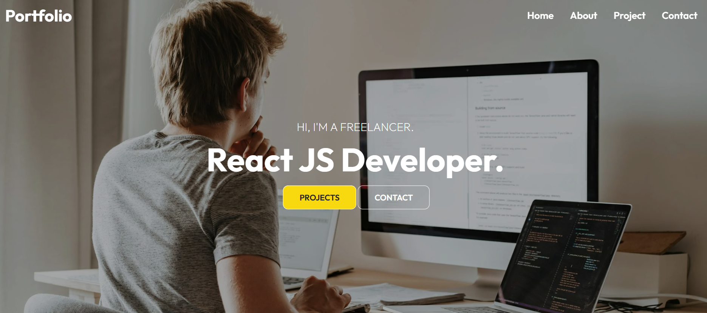

# 💼 Personal Portfolio Website

A clean, modern, and responsive **developer portfolio website** built with **React.js**, showcasing personal skills, projects, and contact information. Styled using **CSS** with beautiful typography from **Google Fonts**, enhanced UI with **React Icons**, and smooth navigation using **React Router**. Powered by **Vite** for blazing-fast performance.

## 🚀 Live Demo

🔗 [View Live Portfolio](https://portfolio-website25.netlify.app/)

---

## 🛠️ Tech Stack

- ⚛️ React.js (with Vite)
- 🌐 React Router DOM
- 🎨 CSS (custom styling)
- 🔤 Google Fonts
- 🎯 React Icons
- ⚡ Vite (lightweight, fast dev server)

---

## 💡 Features

- 🔗 Multi-page navigation using **React Router**
- 🧑‍💻 Portfolio-style layout for showcasing work, skills, and contact
- 🎨 Custom styling with **CSS**
- 🔤 Elegant and readable typography with **Google Fonts**
- 🌙 Responsive and accessible layout
- ⚡ Optimized with **Vite** for fast loading

---

## 📸 Preview

---

Author
Md. Tajul Islam
🌐 [Portfolio Website](https://tajulbappy.netlify.app/)
📧 bappy042@gmail.com
👨‍💻 [GitHub](https://github.com/tajulbappy)

© 2025 Tajul Islam. All rights reserved.
